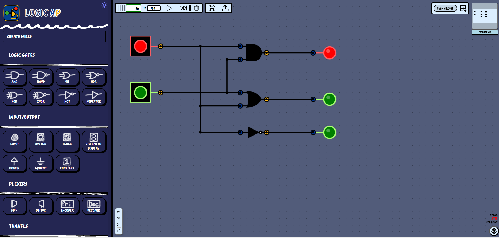

<table style="width: 100%; border: unset !important;">
  <tr>
    <td style="text-align: left;">
      
    </td>
    <td style="text-align: left;font-size:10rem">
      <h1 style="text-decoration: none !important">LogicAp</h1>
    </td>
  </tr>
</table>

LogicAp is a fully functional logic simulator developed as part of the CS1980 course at the University of Pittsburgh from Spring 2025–Spring 2026.

## Contributors 🤝

This project was designed and built by:

- **Sean Shmulevich**  
  - Architecture and integration
- **Joseph Secosky**  
  - Circuit "Backend", DevOps
- **Mason McGinnis**  
  - Full-stack, frontend-focused
- **Gabriel Schmidt**  
- **Matthew Anderson**  
  - Wire grid overhaul
- **Ezra Cheifetz**  
  - Hardcoded subcircuits (Plexers) & scrollbar
- **Carson Gollinger**  
  - Signal propagation overhaul
- **William Waite**
  - Created 9 components & Multi-bit wires & sim speed
## Why is it called LogicAp? 🤔
The name *LogicAp* is derived from the combination of "Logic" and "Capstone," highlighting that this project started as our senior capstone project.

## Tech Stack 🛠️

- **Svelte** - UI framework
- **Vite** - Build and bundle
- **TypeScript** - Programming language
- **DigitalJS** (npm lib) - Logic gate simulation library ([GitHub](https://github.com/tilk/digitaljs))
- **unplugin-icons** (npm lib) - Icon handling for Svelte ([GitHub](https://github.com/unplugin/unplugin-icons))
- **Svelvet** (npm lib) - Canvas/Node/Edge drawing for Svelte ([GitHub](https://github.com/open-source-labs/Svelvet))

## Features ✨

### General Functionality
- Offline functionality 🌐
- Sync circuit with local storage to persist after reload 💾
- Save and load circuit as JSON 📂
- Tabs for organizing different circuits 🗂️
- Change simulation speed 🕐

### Circuit Manipulation
- Manipulate wires 🔌
- Drag and drop nodes onto the canvas 🖱️
- Rotate nodes and wires (NSEW) 🔄
- Support for multiple wire types in one circuit 🔗
- Support for multi-bit wires using busses

### User Interface
- Command menu for quick actions ⌨️
- MiniMap for easy navigation 🗺️
- Settings menu for customization ⚙️

### Circuit Devices
- Logic Gates
- Input/Output
- Plexers
- Tunnels
- Sequential
- Arithmetic
- Subcomponents

## Future Features

- N-input gates
- More multi-bit support
- Colored wires showing signal
- Wire/node selection and movement
- Naming input anchors on subcomponents
- Better wire drawing utility
- Add support for more types of logic gates
- More granular editing functionality
- Convert drawn circuit images into LogicAp-compatible formats
- Integrate Yosys to DigitalJS for outputting circuit representation in different formats ([Yosys2DigitalJS GitHub](https://github.com/tilk/yosys2digitaljs))

### Unresolved Issues

- **Cat**

## License 📄

MIT License (MIT)

Copyright (c) 2026 - Sean Shmulevich, Joseph Secosky, Mason McGinnis, Gabriel Schmidt

Permission is hereby granted, free of charge, to any person obtaining a copy
of this software and associated documentation files (the "Software"), to deal
in the Software without restriction, including without limitation the rights
to use, copy, modify, merge, publish, distribute, sublicense, and/or sell
copies of the Software, and to permit persons to whom the Software is furnished to do so, subject to the following conditions:

The above copyright notice and this permission notice shall be included in all copies or substantial portions of the Software.

THE SOFTWARE IS PROVIDED "AS IS", WITHOUT WARRANTY OF ANY KIND, EXPRESS OR
IMPLIED, INCLUDING BUT NOT LIMITED TO THE WARRANTIES OF MERCHANTABILITY,
FITNESS FOR A PARTICULAR PURPOSE AND NONINFRINGEMENT. IN NO EVENT SHALL THE
AUTHORS OR COPYRIGHT HOLDERS BE LIABLE FOR ANY CLAIM, DAMAGES OR OTHER
LIABILITY, WHETHER IN AN ACTION OF CONTRACT, TORT OR OTHERWISE, ARISING FROM,
OUT OF OR IN CONNECTION WITH THE SOFTWARE OR THE USE OR OTHER DEALINGS IN
THE SOFTWARE.
